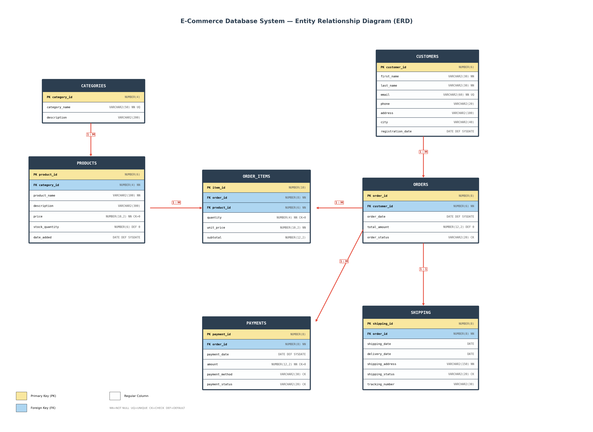

# E-Commerce Database System

A complete relational database project for an **Online Store / E-Commerce System**, built using Oracle SQL as part of the Database Systems course at Riphah International University (Spring 2026).

## Project Overview

This system manages customers, products, categories, orders, order items, payments, and shipping. It demonstrates:

- **ERD** with proper entities, attributes, relationships, and cardinality
- **Normalized schema** up to Third Normal Form (3NF)
- **7 tables** with Primary Keys, Foreign Keys, NOT NULL, UNIQUE, CHECK, and DEFAULT constraints
- **5 Views** for common reporting needs
- **25 Queries** covering Joins, Subqueries, and Aggregation Functions

## Database Schema

| Table | Description |
|-------|-------------|
| `CATEGORIES` | Product categories (Electronics, Clothing, etc.) |
| `PRODUCTS` | Product catalog with price, stock, and category FK |
| `CUSTOMERS` | Customer registration info |
| `ORDERS` | Customer orders with status tracking |
| `ORDER_ITEMS` | Bridge table linking orders to products (M:N) |
| `PAYMENTS` | Payment records per order |
| `SHIPPING` | Shipping and delivery tracking per order |

## ERD (Entity Relationship Diagram)



## Repository Structure

```
ecommerce-db-project/
|-- README.md
|-- sql/
|   |-- 01_create_tables.sql    # DDL - Table creation with constraints
|   |-- 02_insert_data.sql      # DML - Sample data (8 customers, 10 products, 10 orders)
|   |-- 03_views.sql            # 5 Views for reporting
|   |-- 04_queries.sql          # 25 Queries (Joins, Subqueries, Aggregation)
|   |-- 05_drop_tables.sql      # Cleanup script
|-- diagrams/
|   |-- ERD_ECommerce.png       # ERD diagram
|-- report/
    |-- ECommerce_DB_Report.pdf # Complete project report
```

## How to Run

1. Log in to Oracle (e.g., Oracle 11g Express Edition via SQL*Plus or Oracle APEX).
2. Run `sql/05_drop_tables.sql` first if tables already exist.
3. Run `sql/01_create_tables.sql` to create all 7 tables.
4. Run `sql/02_insert_data.sql` to populate sample data.
5. Run `sql/03_views.sql` to create the 5 views.
6. Run `sql/04_queries.sql` to execute all queries.

## Query Summary

| Type | Count | Examples |
|------|-------|---------|
| **Joins** | 6 | INNER, LEFT, RIGHT, FULL OUTER, SELF, 3-Way |
| **Subqueries** | 7 | Single-row, Multi-row (IN, ANY, ALL), Correlated, HAVING |
| **Aggregation** | 12 | COUNT, SUM, AVG, MIN, MAX, GROUP BY, HAVING, DISTINCT |

## Tools & Technologies

- Oracle Database 11g Express Edition / Enterprise Edition
- Oracle APEX (Web Interface)
- SQL*Plus

## Course Info

- **University:** Riphah International University
- **Faculty:** Faculty of Computing
- **Course:** Database Systems
- **Instructor:** Ihtisham Ullah
- **Semester:** Spring 2026
